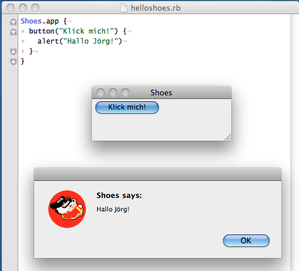

# Keiner kennt Shoes (1): Einführung

>*Deine Mutter sagte Klaus   
Zieh Dir bloß die Schuhe aus*   
*([Marius Müller-Westernhagen][1])*

[1]: href="http://de.wikipedia.org/wiki/Marius_Müller-Westernhagen

**[Shoes][2]** ist erst einmal ein freies (GPL), plattformübergreifendes (Windows, Linux, MacOS X) GUI-Toolkit für [Ruby][3]. Doch obwohl es von sich behauptet, stark von [Processing][4] beeinflußt worden zu sein, erinnert es mich eher an das damals von mir sehr geliebte, aber leider verblichene [HyperCard][5] [^1]. Und da ich beschlossen hatte (oder besser: gezwungen war), wegen meiner Beschäftigung mit [RubyFrontier][6], Ruby zu lernen, blieb ich daher bei diesem Toolkit hängen. Denn ich bin ein visueller Mensch, ich lerne eine neue Programmiersprache am Leichtesten, wenn ich mit ihrer Hilfe mehr oder weniger bunte Bilder herausschreiben kann.

[2]: http://cognitiones.kantel-chaos-team.de/programmierung/creativecoding/shoes.html
[3]: http://cognitiones.kantel-chaos-team.de/programmierung/ruby/ruby.html
[4]: http://cognitiones.kantel-chaos-team.de/programmierung/creativecoding/processing/processing.html
[5]: http://cognitiones.kantel-chaos-team.de/programmierung/hypercard.html
[6]: http://cognitiones.kantel-chaos-team.de/webworking/staticsites/rubyfrontier.html

[^1]: Das von mir damals (1996) ins Netz gestellte [HyperCard-Tutorial](http://www.kantel.de/hc/) (eines meiner ersten Netzaktivitäten) wird tatsächlich bis heute noch hin und wieder aufgerufen, HyperCard scheint also immer noch ein paar Liebhaber zu besitzen, die auf uralten Macs (auf neueren läuft es nämlich nicht mehr) damit herumspielen.

## Installation

Die Installation von Shoes ist (zumindest unter Windows und MacOS X) einfach. Die [Downloadseite][7] bietet für diese beiden Betriebssysteme fertige Pakete an, die sich mit einem Klick installieren. Windows-Nutzer können auch noch entscheiden, ob sie ein etwas größeres Paket von Shoes herunterladen, das die Einbindung von Videos erlaubt (empfohlen), oder ob sie zugunsten eines kleineren Paketes auf die Video-Fähigkeit verzichten. Linux-Nutzer müssen die aktuelle Version [selber kompilieren](), aber Linux-Nutzer sind das ja gewohnt.

[7]: http://shoesrb.com/downloads
[8]: https://github.com/shoes/shoes/wiki/Building-Shoes-on-Linux

Die fertigen Pakete für Windows und MacOS X bringen auch ein eigenes Ruby 1.9.3 mit, auf das sie zugreifen, Linux-Nutzer müssen das ebenfalls vorher noch installieren.

Für MacOS X gibt es zusätzlich auch noch ein schönes [TextMate][9]-Bundle, mit dem Ihr unter anderem Eure Shoes-Skripte aus diesem beliebten Editor heraus mit ⌘-R starten könnt. Ich empfehle Euch daher, dieses Bundle [hier herunterzuladen][10] und ebenfalls zu installieren.

[9]: http://cognitiones.kantel-chaos-team.de/produktivitaet/textmate.html
[10]: https://github.com/jballanc/shoes-tmbundle

## Hello World!

Jede Einführung in eine Programmiersprache beginnt mit einem »Hello World«-Programm und wer bin ich, gegen diese Konvention zu verstoßen? Also schmeißt den Editor Eures Vertrauens an und gebt folgendes ein:

~~~ruby
Shoes.app {
	button("Klick mich!") {
		 alert("Hallo Jörg!")
	}
}
~~~

Ihr könnt es dann z.B. unter `helloshoes.rb` abspeichern (Shoes-Skripte sind Ruby-Skripte und erwarten daher die Standard-Endung für Ruby). Wenn Ihr dieses winzige Progrämmchen nun anwerft, sollte auf Eurem Monitor ungefähr folgendes zu sehen sein:

Das Fenster mit dem *Klick mich*-Button habe ich vor dem Screenshot etwas in seiner Größe zurechtgeschoben, es war etwas zu groß geraten, aber ansonsten habe ich alles so gelassen.

Ruby-Skripte bestehen aus Blöcken, die entweder in geschweiften Klammern `{…}` eingeschlossen werden können, oder mit `do … end` geklammert werden. Ich bevorzuge die letztere Methode, daher sieht das *Hello World*-Skript bei mir so aus:

~~~ruby
Shoes.app do
	button("Klick mich!") do
		 alert("Hallo Jörg!")
	end
end
~~~

Ich finde das übersichtlicher (zumal es in TextMate auch noch so schön farblich hervorgehoben wird), aber das ist sicher Geschmackssache. Im weiteren Verlauf dieses Tutorials werde ich allerdings die `do … end`-Klammerung verwenden.

Alle Shoes-Skripte beginnen mit einem `Shoes.app`-Block. Dieser teilt dem Ruby-Interpreter mit, daß es sich um eine Shoes-Anwendung handelt. Innerhalb dieses Blocks können dann sowohl normale Ruby-Anweisungen wie auch Shoes-spezifische Befehle aufgerufen werden.

## Layout

Das Problem aller GUI-Toolkits ist es sicher, eine einfache Möglichkeit zu finden, fließende Layouts zu gestalten. Den bei fast allen Betriebssystemen kann der Nutzer die Fenstergröße verändern und das Layout sollte sich dann möglichst sinnvoll dieser Größenänderung anpassen.

Shoes benutzt dafür ein meiner Meinung nach ziemlich geniales Konzept. Es kennt `flows` und `stacks`.

`flows` sind Layout-Blöcke, die ihre Elemente solange nebeneinander aufreiehn, bis die Fensterbreite erreicht ist, danach wird das nächste Element einfach in die nächste Reihe geschoben. Wenn dazu mehr Platz benötigt wird, als die Fenstergröße zuläßt, wird ein vertikaler Scrollbalken dazugeschaltet. Aus diesem Konzept wird schon klar, Shoes glaubt nicht an die Nützlichkeit von horizontalen Scrollbalken und kennt diese folgerichtig auch nicht.

`stacks` hingegen sind Layout-Blöcke, die einfach von oben nach unten *gestapelt* werden.

Der Trick eines guten Shoes-GUI-Layouts besteht nun darin, flows und stacks sinnvoll zu kombinieren, um etwas Ansprechendes zu bekommen. Zum Beispiel so:

~~~ruby
Shoes.app :width => 600, :height => 400 do
	 flow :width => 600, :margin => 20 do
	   stack :width => "100%" do
	     banner "Jörg Kantel"
	   end

	   stack :width => "270px" do
	     image "images/joerg_kantel.jpeg"
	   end
	   stack :width => "-280px" do
	     para "Netzaktivist und Blogger"
	     para "Begeisterter Hundesportler"
	     para "Lebt in Neukölln"
	     para "… und lernt jetzt Ruby!"
	   end
	 end
end
~~~

Die Texte und das Bild werdet Ihr sicher Euren Bedürfnissen anpassen wollen, aber schon auf dem ersten Blick könnt Ihr einiges erkennen:

  * Bilder können einfach mit dem Befehl `image` eingebunden werden und Shoes kennt relative Pfade (relativ zum Speicherort des Skripts, nicht zum Ruby-Interpreter).
  * `para` ist der Shoes-Befehl für einen Absatz und `banner` der für eine Überschrift.

Doch bevor ich weiter auf die *flow*- und *stacks*-Blöcke eingehen werde, möchte ich Euch das Ergebnis dieses kleinen Skriptes zeigen:

Das ist das Ergebnis. Und damit wird vielleicht auch schon klarer, was diese *flows* und *stacks* bedeuten. Doch als erstes seht Ihr, daß man schon dem Shoes-Skript beim Aufruf die initiale Breite und Höhe des Ausgabefensters mitteilen kann.

Danach habe ich alles in einen *flow*-Aufruf geklammert, der ebenfalls die Breite von 600 Pixeln besitzt, aber überall einen Rand von 20 Pixeln besitzen soll. Innerhalb dieses *flows* kommt dann als erstes ein *stack* in der Weite von 100 Prozent mit der Überschrift.

Darunter gibt es einen *stack* mit einem Bild. Dieser Stack besitzt eine Breite von 270 Pixeln (das ist in etwa die Breite des Bildes). Dem nächsten *stack* habe ich mirgeteilt, daß er erst bei Pixel 280 beginnen soll (das ist die Bedeutung des Minus-Zeichens vor der Breitenangabe). Der Interpreter schaut in seinem Layout nach und stellt fest: Da ist noch Platz **neben** dem Bild, also platziere ich diesen *stack* dorthin und nicht unter dem Bild.

So einfach geht also ein zweispaltiges Layout mit einer Überschrift, die über beide Spalten geht.

## Animation

Shoes besticht aber nicht nur durch seine Fähigkeit, einfach Layouts zu erstellen, sondern es kann genau so einfach Animationen erzeugen. Schaut Euch doch einfach mal diesen Quellcode an und laßt ihn auf Eurem Rechner laufen:

~~~ruby
Shoes.app :widht => 800, :height => 400 do

	@o = oval :top => 0, :left => 0, :radius => 40, :fill => red

	flow :width => 800, :margin => 40 do
	   stack :width => "100%" do
	      title "Tanz mit dem roten Mond"
	      subtitle "Wie stolz und rund."
	   end
	 end

	 motion do |x, y|
	   @o.move width - x, height - y
	 end

end
~~~

Als erstes fällt auf, daß Shoes sein eigener Konstruktor ist und daher auch Instanzvariablen initialisieren kann (`@o`) – das sollte vor dem ersten Block geschehen. In diesem Fall wird ein roter Kreis erzeugt mit einem Radius von 40 Pixeln erzeugt.

Dann wird ein einfaches Layout mit einem einzigen *flow* und einem darin eingebundenen *stack* erstellt.

`motion` ist die Animationsmethode. Es ist leicht zu erkennen, daß sie dazu führt, daß der Kreis einen kleinen Tanz mit Eurem Mauszeiger ausführt. Sieht das nicht anmutig aus?

## UTF-8

Wie Ihr sicher schon an dem Umlaut in meinem Vornamen festgestellt habt: Shoes ist Unicode-fest, das darunterliegende Ruby 1.9.3 ebenfalls weitestgehend. Deutsche Umlaute und französische Akzente etc. sollten daher in einem normalen Shoes-Skript keine Probleme bereiten -- vorausgesetzt, der von Euch eingesetzte Zeichensatz kennt diese Zeichen.

## Fazit

Wer mit Ruby mehr anstellen will, als Skripte für RubyFrontier oder *Ruby on Rails* zu schreiben, der sollte sich Shoes ruhig einmal genauer anschauen. Shoes macht Spaß und ich werde sicher weiter die Schuhe anbehalten, damit experimentieren und berichten …

---

Zurück zur [Startseite](index.html).v