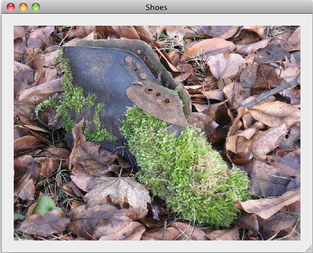
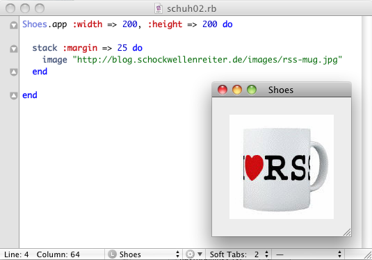

# Keiner kennt Shoes (2): Bilder und Links

Wie ich im [letzten Kapitel][1] schon gezeigt hatte, ist das Einbinden von Bildern in ein Shoes-Skript einfach. [Shoes](cp^Shoes) kennt sowohl relative Links (ausgehend vom Speicherort des Skripts, nicht vom Speicherort des Interpreters) als auch absolute Links und so bekommt Ihr in wenigen Zeilen ein Bild in Euer Programmfenster eingebunden:

~~~ruby
Shoes.app :width => 520, :height => 400 do
	 stack :margin => 20 do
	   image "images/schuh01.jpg"
	 end
end
~~~

[1]: 01shoes.html

Und heraus kommt dieses Bild (die Größe Eures Fensters müßt Ihr natürlich an die Größe Eures Bildes anpassen):

Aber das ist nicht alles: Ihr könnt sogar einen Link hinter das Bild legen, wenn Ihr die dritte Zeile des Skriptchens so erweitert:

~~~ruby
image "images/schuh01.jpg", :click => "http://www.flickr.com/photos/schockwellenreiter/2151239639/"
~~~

Wenn Ihr nun auf das Bild klickt, öffnet Shoes Euren Browser[^1] und zeigt die [Seite mit dem Bild][2] auf Flickr.

[2]: http://www.flickr.com/photos/schockwellenreiter/2151239639/

[^1]: Wenn es ein *externer* Links ist. Shoes kann auch *interne* Links, das heißt Links zu anderen Fenstern des gleichen Skripts, doch das ist einem späteren Tutorial vorbehalten.

Links können natürlich auch hinter Texten hinterlegt werden. Wenn Ihr dem Skript noch einen zweiten Stack gönnt

~~~ruby
stack :margin => 20 do
	   para "Das ist ein ", link("Navigationsschuh", :click => "http://www.flickr.com/photos/schockwellenreiter/2151239639/"),", die Wetterseite ist bemoost."
end
~~~

Dann funktioniert auch das wie erwartet. Die Höhe des Fensters habe ich dabei auf `500` gesetzt, damit der Satz auch ohne Scrollbalken noch lesbar bleibt.

Aber wartet, es gibt noch mehr: Shoes kann die Bilder auch aus dem Netz laden. Da Flickr leicht sauer wird, wenn jemand Bilder von dort ohne Rücklink benutzt, habe ich ein Bildchen aus dem *Schockwellenreiter* für dieses Beispiel ausgesucht:

Statt des relativen oder absoluten Pfades müßt Ihr Shoes dann die URL zu dem Bild mitteilen:

~~~ruby
image "http://blog.schockwellenreiter.de/images/rss-mug.jpg"
~~~

Und schon holt sich Shoes das Bild aus dem Netz -- vorausgesetzt natürlich, Ihr seid mit dem Netz verbunden. Wunder kann nämlich auch Shoes nicht bewirken.

---

Zurück zur [Startseite](index.html).