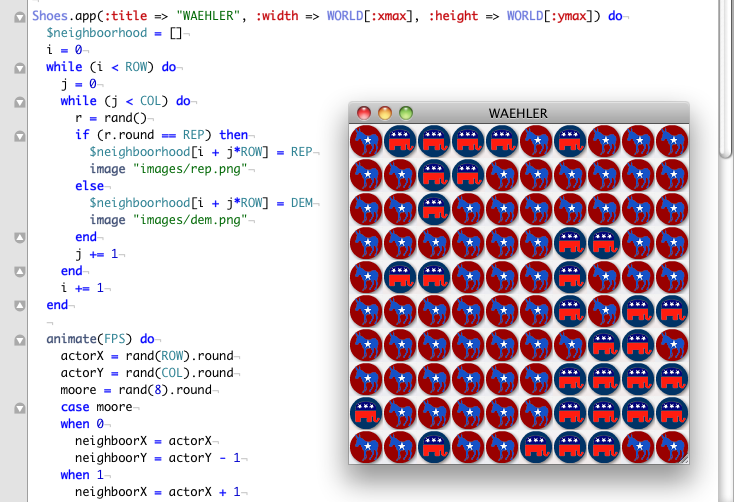

# Keiner kennt Shoes (3): Das Demokratie-Spiel

Das **Demokratie-Spiel** ist ein Spiel, das Peter Donelly vom *University College of Swansea* in Wales und Domenic Welsh von der *Oxford University* schon in den 80er Jahren des letzten Jahrhunderts untersucht hatten. Populär wurde es dann durch eine Veröffentlichung von Alexander K. Dewdney in der *Scientific American* und in der deutschen Schwesterzeitschrift *Spektrum der Wissenschaft*. Er nannte das Spiel »WAEHLER«.

In diesem Spiel werden die Felder eines rechteckigen Feldes (hier 10 x 10 Felder) zuerst wahllos mit den Symbolen der Republikaner (Elephant) oder der Demokraten (Esel) besetzt. Das widerspiegelt die politische Einstellung der »Einwohner« dieses »Planeten«. Bei jedem Spielzug wird nun ein Einwohner in seiner politischen Meinung schwankend und nimmt die Einstellung eines seiner zufällig herausgegriffenen Nachbarn an.

Als Nachbarschaft gilt hier die [Moore-Nachbarschaft][1], also alle 8 Nachbarfelder. Die Randbedingungen sind periodisch, d.h. jeder Spieler auf einem Randfeld hat »Nachbarn« auf der gegenüberliegenden Seite, die Spieler in den Eckfeldern sogar auf beiden gegenüberliegenden Seiten. Unser Spielfeld nimmt daher die Form eines Reifens oder eines Torus an, wie auch im Spiel WATOR.

[1]: http://cognitiones.kantel-chaos-team.de/programmierung/softcomputing/moorenb.html

Nun passiert Folgendes: Aus der anfänglich wüsten Verteilung bilden sich im Laufe des Spiels feste Inseln einer Meinung heraus. Und im Endeffekt gewinnt eine Partei die alleinige Herrschaft. Das geschieht manchmal sehr schnell, manchmal dauert es länger, weil sich einige Inseln des Widerstands hartnäckig halten, aber das Endergebnis ist immer gleich: Der Planet wird entweder komplett von Eseln oder komplett von Elephanten regiert. Ob das der Sinn einer Demokratie ist?

Das Spiel ist verwandt mit dem Selektions-Spiel, das Ruthild Winkler und Manfred Eigen schon 1975 in ihrem Buch *Das Spiel* vorgestellt hatten. Auch wenn die Regeln leicht abgewandelt sind, das Ergebnis ist stets das gleiche. Es überlebt immer nur eine Partei. Das ändert sich übrigens auch nicht, wenn man das Feld mit mehr als zwei Parteien beim Start füllt.

## Der Code

Der [Ruby][2]-Code für [Shoes][3] ist *straight forward*. Lediglich die Behandlung der Randbedingungen ist allgemeiner gehalten, als unbedingt nötig. Damit sind bei Abwandlungen auch andere Nachbarschaften als die Moore-Umgebung möglich.

[2]: http://cognitiones.kantel-chaos-team.de/programmierung/ruby/ruby.html
[3]: http://cognitiones.kantel-chaos-team.de/programmierung/creativecoding/shoes.html

~~~ruby
FPS = 25
REP = 0
DEM = 1
ROW = 10
COL = 10
ICON_SIZE = 34
WORLD = {:xmax => ICON_SIZE*ROW, :ymax => ICON_SIZE*COL}

Shoes.app(:title => "WAEHLER", :width => WORLD[:xmax], :height => WORLD[:ymax]) do
	 $neighboorhood = []
	 i = 0
	 while (i < ROW) do
	   j = 0
	   while (j < COL) do
	     r = rand()
	     if (r.round == REP) then
	       $neighboorhood[i + j*ROW] = REP
	       image "images/rep.png"
	     else
	       $neighboorhood[i + j*ROW] = DEM
	       image "images/dem.png"
	     end
	     j += 1
	   end
	   i += 1
	 end

	 animate(FPS) do
	   actorX = rand(ROW).round
	   actorY = rand(COL).round
	   moore = rand(8).round
	   case moore
	   when 0
	     neighboorX = actorX
	     neighboorY = actorY - 1
	   when 1
	     neighboorX = actorX + 1
	     neighboorY = actorY - 1
	    when 2
	      neighboorX = actorX + 1
	      neighboorY = actorY
	   when 3
	     neighboorX = actorX + 1
	     neighboorY = actorY + 1
	   when 4
	     neighboorX = actorX
	     neighboorY = actorY + 1
	   when 5
	     neighboorX = actorX - 1
	     neighboorY = actorY + 1
	   when 6
	     neighboorX = actorX - 1
	     neighboorY = actorY
	   when 7
	     neighboorX = actorX - 1
	     neighboorY = actorY - 1
	   end

	   if (neighboorX < 0) then
	     neighboorX = ROW + neighboorX
	   end
	   neighboorX = neighboorX % ROW

	   if neighboorY < 0 then
	     neighboorY = COL + neighboorY
	   end
	    eighboorY = neighboorY % COL

	   if ($neighboorhood[neighboorX + neighboorY*ROW] == DEM) then
	     $neighboorhood[actorX + actorY*ROW] = DEM
	   else
	     $neighboorhood[actorX + actorY*ROW] = REP
	   end
	   clear do
	     k = 0
	     while (k < $neighboorhood.length) do
	       if ($neighboorhood[k] == REP) then
	         image "images/rep.png"
	       else
	         image "images/dem.png"
	       end
	       k += 1
	     end  
	   end
	 end
end
~~~

Wer das Spiel selber nachprogrammieren möchte, hier gibt es auch noch die beiden Icons für die Republikaner (Elephant) und Demokraten (Esel):

 &nbsp; 

## Literatur

  * A.K. Dewdney: *Wie man π erschießt. Fünf leichte Stücke für WHILE-Schleifen und Zufallsgenerator, oder: lebensechte Simulationen von Zombies, Wählern und Warteschlangen*, in: Immo Diener (Hg.): *<a href="http://www.amazon.de/gp/product/3922508502/ref=as_li_ss_tl?ie=UTF8&camp=1638&creative=19454&creativeASIN=3922508502&linkCode=as2&tag=derschockwell-21">Computer-Kurzweil</a>*, Heidelberg (Spektrum der Wissenschaft, Reihe: Verständliche Forschung) 1988
  * Manfred Eigen, Ruthild Winkler: *<a href="http://www.amazon.de/gp/product/3492204104/ref=as_li_ss_tl?ie=UTF8&camp=1638&creative=19454&creativeASIN=3492204104&linkCode=as2&tag=derschockwell-21">Das Spiel. Naturgesetze steuern den Zufall</a>*, München (Piper), 1975 (unveränderte Taschenbuchausgabe 1985)

---

Zurück zur [Startseite](index.html).