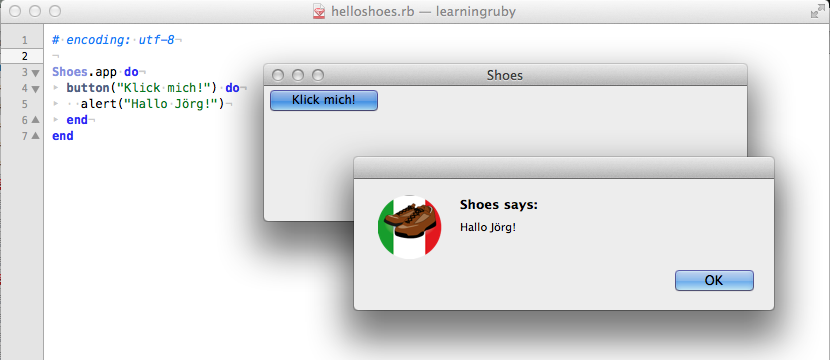

# Brandneue Schuhe, denn keiner kennt Shoes

Wegen Problemen mit der Darstellung von Umlauten hatte ich ja meine Experimente mit Shoes 3.2.17 abgebrochen und war zu Shoes 3.1 zurückgekehrt. Nachdem nun aber Shoes 3.2.18 erschienen war, wollte ich es noch einmal wissen. Doch wieder kam die Fehlermeldung `Invalid Character`, die auf das »ö« in meinem Vornamen zeigte. Doch dann erinnerte ich mich, daß ich ähnliche Probleme mit [Ruby](cp^Ruby) schon einmal gelöst hatte, in dem ich in der ersten Zeile des Programms mit

~~~ruby
# encoding: utf-8
~~~

explizit auf auf die UTF-8-Codierung hinwies. Und siehe da, damit funktionierte auch das »ö« in meinem Vornamen wieder. Somit bin ich nun im Besitz eines Paares brandneuer Schuhe, denn keiner kennt Shoes. (Sicherheitshalber habe ich mir mein altes Paar aber aufgehoben.)

## Caveat

Sollte man versuchen, Shoes 3.2 zu starten, während Shoes 3.1 noch offen ist, dann kommt der Rechner dadurch so durcheinander, daß Shoes sich anschließend nur nach einem Neustart wieder zum Arbeiten bewegen läßt.

---

Zurück zur [Startseite](index.html).