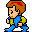

# Keiner kennt Shoes (4): Spieleprogrammierung

Ich muß gestehen, ich bin ein Fan von Spielen aus der [Frühzeit der Computerspiele][1], wo kleine pixelige Männchen über den Bildschirm wuselten, der in ein 32x32- oder ein 16x16-Raster aufgeteilt war und in dem diese kleinen Männchen mit Monstern, Orks, Dämonen oder Zombies kämpfen mußten, um Schätze aufzusammeln, ein geheimes Amulett zu finden oder eine hübsche (Pixel-) Prinzessin aus den Klauen des Obermonsters zu befreien. In den ganz frühen Versionen wurden Helden, Monster, Amulette etc. sogar noch durch ASCII-Zeichen auf dem Bildschirm dargestellt, später wurden diese durch statische Graphiken ersetzt. Aber richtig witzig wurde es dann, als diese Figuren sich bewegten. In vielen Fällen wurde die Bewegung durch vier Einzelbilder je Bewegungsrichtung realisiert, die sich abwechselten. Da sah den schon sehr realistisch und professionell aus, aber den eigentlichen Charme hatten die Spiele, die sich mit zwei Bildern pro Bewegungsrichtung begnügten. Denn das gab den Figuren den »wuseligen« Charakter.

[1]: http://cognitiones.kantel-chaos-team.de/medien/retrogames/retrogames.html

Damals hatte ich auch ein [Tutorial geschrieben][2], wie man solch ein Spiel mit statischen Graphiken in [HyperCard][3] programmiert. HyperCards interpretierte Programmiersprache HyperTalk war zu langsam, um bewegliche Spielfiguren über den Bildschirm der klassischen Macintosh-Computer wuseln zu lassen, das ging nur mit compilierten Sprachen und Ausflügen in Assembler. Heute ist Geschwindigkeit aber kein Problem mehr und da ich sowieso meine [Ruby][4]-Skills mithilfe von [Shoes][5] verbessern will, habe ich mal ausprobiert, wie so etwas aussehen könnte.

[2]: http://www.kantel.de/hc/hypertalk7.html
[3]: http://cognitiones.kantel-chaos-team.de/programmierung/hypercard.html
[4]: http://cognitiones.kantel-chaos-team.de/programmierung/ruby/ruby.html
[5]: http://cognitiones.kantel-chaos-team.de/programmierung/creativecoding/shoes.html

## Der Held

Jedes Spiel braucht einen Helden und den müßt Ihr auf dem Bildschirm platzieren. Aber da auch ein (Computerspiel-) Held erst einmal nichts anderes ist, als ein Bild, geschieht dies mit dem Befehl `image`, wie ich [hier schon einmal](shoes02) gezeigt hatte. Das ist erst einmal ein kleines Programm:

~~~ruby
# encoding: utf-8

Shoes.app do
	 x, y = self.width/2, self.height/2
	 hero = image "images/mnv1_rt1.gif", :left => x, :top => y
end
~~~

Die erste Zeile (`# encoding: utf-8`) kann eigentlich entfallen. Zum einen, wenn Ihr (noch) mit Shoes 3.1 arbeitet, zum anderen -- falls Ihr Shoes 3.2 nutzt -- braucht Ihr diese Zeile nur, wenn Ihr Zeichen jenseits von ASCII nutzt. Die Zeile schadet aber auch nicht und da ich ständig zwischen Shoes 3.1 (unter MacOS X Snow Leopard) und Shoes 3.2 (unter MacOS OX Mavericks) wechsle, habe ich mir angewöhnt, sie ständig mitzuschleppen.

Die Bildchen für den Helden habe ich mir von Philipp Lenssen ausgeborgt und in einem Ordner `images` unterhalb des Quellcodes abgelegt. Philipp Lenssen hat auf seiner Seite [über 700 Bilder animierter Charactere][6] unter der [Creative Commons attribution 3.0][7]-Lizenz zur freien Verwendung zur Verfügung gestellt hat. Später benötige ich noch ein paar mehr und falls Ihr das nachprogrammieren wollt, hier schon mal alle Bildchen.

[6]: http://blogoscoped.com/archive/2006-08-08-n51.html
[7]: http://creativecommons.org/licenses/by/3.0/

   

Ihr könnt Euch natürlich auf seiner Seite auch einen Helden aussuchen, der Euch besser gefällt.

Mit der Zeile

~~~ruby
x, y = self.width/2, self.height/2
~~~

habe ich die Position des Helden ungefähr auf die Mitte des Fensters festgelegt und ihn dann mit

~~~ruby
hero = image "images/mnv1_rt1.gif", :left => x, :top => y
~~~

auch dort platziert. Die Koordinaten (`:left`, `:top`) beziehen sich übrigens immer auf die linke, obere Ecke des Sprites.

Wem das Grau des Hintergrunds stört, der kann mit

~~~ruby
background forestgreen
~~~

einen gefälligen grünen Hintergrund schaffen. Shoes verfügt über eine Palette [vorgefertigter Farbnamen](), sollte darunter nichts Passendes für Euch sein, könnt Ihr natürlich auch eine eigene Farbe zum Beispiel mithilfe der [rgb][9]-Methode definieren.

[8]: http://shoesrb.com/manual/Colors.html
[9]: http://shoesrb.com/manual/Built-in.html#rgb

## Bewegung!

Nun möchte ich natürlich etwas Bewegung in die Sache bringen. *Image-Swapping*, also der Austausch von Bildern, funktioniert in Shoes dadurch, daß der Variable einfach ein neuer Pfad zu einem weitern Bild zugewiesen wird. Die einzelnen Bilder werden intern gecached, so daß nicht bei jedem neuen Aufruf die Festplatte bemüht wird.

Shoes besitzt eine `animate`-Funktion, die die darin enthaltenen Anweisungen immer wieder mit einer bestimmten Frameanzahl pro Sekunde ausführt. Damit sieht das Programm nun schon so aus:

~~~ruby
# encoding: utf-8

FPS = 15
xdir = 1

Shoes.app do
	 background forestgreen
	 x, y = self.width/2, self.height/2
	 hero = image "images/mnv1_rt1.gif", :left => x, :top => y
  
	 animate(FPS) do |frame|
	   if xdir == 1 then
	     if frame % 2 == 0 then
	       hero.path = "images/mnv1_rt1.gif"
	     else
	       hero.path = "images/mnv1_rt2.gif"
	     end
	   end
	 end
end
~~~

Oben habe ich die Anzahl der Frames pro Sekunde mit `FPS = 15` festgelegt und außerdem bewegt sich unser Held momentan nur nach rechts (`xdir = 1`). Das heißt, eigentlich bewegt er sich noch gar nicht, sondern tritt nur auf der Stelle, weil bei jedem geraden Frame das Bild `mnv1_rt1.gif` und bei jedem ungeraden Frame das Bild `mnv1_rt2.gif` angezeigt wird.

Jetzt möchte ich aber wirklich Bewegung in die Angelegenheit bringen:

~~~ruby
# encoding: utf-8

FPS = 15
xspeed, yspeed = 4, 0
xdir, ydir = 1, 1

Shoes.app do
	 background "images/map.png"
	 x, y = self.width/2, self.height/2
	 hero = image "images/mnv1_rt1.gif", :left => x, :top => y
	 size = hero.size
  
	 animate(FPS) do |frame|
    
	   x += xspeed * xdir
	   y += yspeed * ydir
    
	   xdir *= -1 if x > self.width - size[0] or x < 0
    
	   if xdir == 1 then
	     if frame % 2 == 0 then
	       hero.path = "images/mnv1_rt1.gif"
	     else
	       hero.path = "images/mnv1_rt2.gif"
	     end
	   end
    
	   if xdir == -1 then
	     if frame % 2 == 0 then
	       hero.path = "images/mnv1_lf1.gif"
	     else
	       hero.path = "images/mnv1_lf2.gif"
	     end
	   end
    
	   hero.move x.to_i, y.to_i
	 end
end
~~~

Jetzt sieht das Programm schon etwas länger aus. Der Held bewegt sich. Von links nach rechts und damit er nicht aus dem Bild herausläuft, habe ich mit

~~~ruby
xdir *= -1 if x > self.width - size[0] or x < 0
~~~

dafür gesorgt, daß er beim Erreichen des Fensterendes kehrt macht und in die andere Richtung läuft (`xdir` ändert das Vorzeichen). Und für die Bewegung von rechts nach links werden jetzt noch zwei andere Bilder geladen.

Dem Hintergrund habe ich mit `images/map.png` ein Bild zugewiesen. Dieses ist nur 32x32 Pixel groß, aber Shoes kachelt den Hintergrund automatisch. Wenn Ihr die Fenstergröße mit der Maus ändert, werdet Ihr sehen: Die ganze Welt besteht aus Rasen!

Aber was Ihr dann auch sehen werdet: Das Vergrößern (oder Verkleinern) des Fensters ändert die Variable `self.width` nicht. Unser Held kehrt immer noch an der alten Stelle um. Daher solltet Ihr mit `:resizable => false` dieses unterbinden. Und da ich außerdem ein Fan der alten Bildschirmauflösung von 640x320 Pixeln bin, mit der viele der alten Computerspiele liefen, habe ich das Fenster auch gleich auf diese Größe festgelegt. Das bietet sich an, da diese beiden Zahlen ein Vielfaches von 32 darstellen und so unsere Tiles und auch die Sprites vollständig aufgenommen werden können. Die entsprechende Zeile sieht also nun so aus:

~~~ruby
Shoes.app :width => 640, :height => 320, :resizable => false do
~~~

Nun muß der kleine Mann aber nicht ständig geradeaus laufen. Mit den Variablen `xdir` und `ydir` könnt Ihr spielen. Mir persönlich gefällt die Kombination `4, 3` für erste Versuche sehr gut. Damit der Held dann aber nicht oben oder unten aus dem Bild verschwindet, solltet Ihr das mit

~~~ruby
ydir *= -1 if y > self.height - size[1] or y < 0
~~~

ebenfalls zu verhindern wissen.

## Der (komplette) Quellcode

~~~ruby
# encoding: utf-8

FPS = 15

xspeed, yspeed = 4, 3
xdir, ydir = 1, 1

Shoes.app :width => 640, :height => 320, :resizable => false do
	 background "images/terrain.png"
	 gold = image "images/gold.gif", :left => 120, :top => 128
	 x, y = self.width/2, self.height/2
	 hero = image "images/mnv1_rt1.gif", :left => x, :top => y
	 size = hero.size
	 nostroke
  
	 animate(FPS) do |frame|

	   x += xspeed * xdir
	   y += yspeed * ydir
    
	   xdir *= -1 if x > self.width - size[0] or x < 0
	   ydir *= -1 if y > self.height - size[1] or y < 0
    
	   if xdir == 1 then
	     if frame % 2 == 0 then
	       hero.path = "images/mnv1_rt1.gif"
	     else
	       hero.path = "images/mnv1_rt2.gif"
	     end
	   end
    
	   if xdir == -1 then
	     if frame % 2 == 0 then
	       hero.path = "images/mnv1_lf1.gif"
	     else
	       hero.path = "images/mnv1_lf2.gif"
	     end
	   end
	   hero.move x.to_i, y.to_i
	 end
end
~~~

Der Rest ist Kosmetik. Die Graphik für den Hintergrund (`terrain.png`) habe ich mit [Tiled][10] und den freien [Angband][11] Tilesets, wie sie zum Beispiel [hier zu finden sind][12], erstellt.

[10]: http://cognitiones.kantel-chaos-team.de/multimedia/spieleprogrammierung/tiled.html
[11]: http://cognitiones.kantel-chaos-team.de/medien/retrogames/angband.html
[12]: http://pousse.rapiere.free.fr/tome/

Und da der Held ja auch irgendwann einmal einen Schatz finden soll, habe ich mit

~~~ruby
gold = image "images/gold.gif", :left => 120, :top => 128
~~~

(das Bild ist ebenfalls aus dem Angband-Tiles) schon einmal einen Goldhaufen auf das Gelände gezaubert.

Natürlich ist noch viel zu tun. Außer an den Weltenden reagiert unser wuseliger Held nicht auf Hindernisse und wenn er endlich den Goldhaufen erreicht hat, trampelt er auch nur darauf herum. Und ein echtes Spiel sollte natürlich auf Benutzereingaben reagieren. Aber ein Anfang ist gemacht. In einem nächsten Beitrag werde ich dann weiter spielen.

---

Zurück zur [Startseite](index.html).