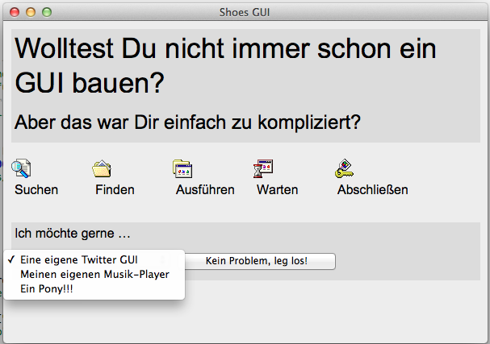
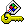

# Keiner kennt Shoes: GUI 95 (1)

**Vorbemerkung**: In diesem Tutorial zeige ich, wie man mit [Shoes][1], dem kleinen [Ruby][2]-Toolkit für plattformübergreifende 2D-Graphik und GUI-Erstellung ein kleines GUI baut. Es ist erst einmal nur ein *Mockup* ohne Funktionalität. Im [nächsten Kapitel][3] werde ich daraus ein voll funktionsfähiges Progrämmchen mit klickbaren Links und Buttons erstellen.

[1]: http://cognitiones.kantel-chaos-team.de/programmierung/creativecoding/shoes.html
[2]: http://cognitiones.kantel-chaos-team.de/programmierung/ruby/ruby.html
[3]: 07shoes.html

Das GUI ist die Abwandlung einer Idee, die auf der [Website von Shoes][4] vorgestellt wird. Ich wollte es ein klein wenig peppiger machen und habe daher Icons benutzt, wie sie so oder ähnlich in [Windows 95][5] Verwendung fanden (daher der Name »GUI 95«). Die Icons habe ich irgendwo in den Tiefen des Webs gefunden und das fertige GUI sollte hinterher so aussehen:

[4]: http://shoesrb.com
[5]: http://de.wikipedia.org/wiki/Windows%2095

Um es vorwegzunehmen, das Programm, das diese Benutzeroberfläche erstellt, ist von erfrischender Kürze:

~~~ruby
# encoding: utf-8

Shoes.app(title: "Shoes GUI", width: 600, height: 400) do
    
	   stack margin: 10 do
	     background gainsboro
	     subtitle "Wolltest Du nicht immer schon ein GUI bauen?"
	     tagline "Aber das war Dir einfach zu kompliziert?"
	   end
    
	   stack margin: 10 do
	     flow do
	       buttons = {
	         find: "Suchen",
	         documents: "Finden",
	         programs: "Ausführen",
	         run: "Warten",
	         logoff: "Abschließen"
	       }
    
	       buttons.each do |key, value|
	         stack width: 100 do
	           image "images/#{key.to_s}.gif"
	           para value
	         end
	       end
	     end
	   end
  
	   stack margin: 10 do
	     background gainsboro
	     para "Ich möchte gerne …"
	     flow do
	       list_box items: ["Eine eigene Twitter GUI", "Meinen eigenen Musik-Player", "Ein Pony!!!"]
	       button "Kein Problem, leg los!"
	     end
	   end
end
~~~

In der ersten Zeile lege ich den Zeichensatz auf UTF-8 fest, da ich ein paar Umlaute eingebaut habe. Sie ist in Shoes&nbsp;3.1 (Policeman) nicht notwendig, aber in Shoes 3.2 und größer, da dort mit Ruby 2.x gearbeitet wird und die Zeichencodierung etwas anders funktioniert. Sie schadet aber in Shoes 3.1 nicht (sie wird schlicht als Kommentar ignoriert), so daß Ihr auf der sicheren Seite seid, wenn Ihr diese Zeile in jedem Euerer Shoes-Skripte einfügt.

Danach wird das Hauptfenster festgelegt. Es besitzt eine Größe von 600 x 400 Pixeln und ist in der Größe veränderbar. Solltet Ihr das nicht wollen, müßt Ihr die Zeile zu

~~~ruby
Shoes.app(title: "Shoes GUI", width: 600, height: 400, resizeable: false) do
~~~

ändern. Aber erst einmal solltet Ihr die Zeile so lassen und das Fenster vergrößern und verkleinern, so daß Ihr seht, wie sich *Flows* and *Stacks* dabei verhalten. Nach dieser Zeile folgt der erste `stack`. Stacks sind im Shoes-Jargon Layout-Elemente, die immer die gesamte Breite des Elternelements ausfüllen und untereinander angeordnet werden (daraus folgt: Shoes hält nichts von horizontalen Scrollbalken).

Der zweite Container – ebenfalls ein Stack – enthält einen `flow`. Flows werden solange nebeneinander angeordnet, bis sie die Breite des Eltern-Containers ausfüllen, dann wird eine neue Reihe angelegt. Dort wird als erstes eine Variable `buttons` definiert, die ein Array von *Hashes* (oder für Pythonistas: *Dictionaries*) enthält. Der Einfachheit halber entsprechen die Schlüssel den Dateinamen der Icons (ohne `.gif`) und die Werte den Texten, die unter den Bildchen erscheinen sollen. Und so werden sie in der darunterliegenden Schleife auch angeordnet: Es sind jeweils Stacks mit einer festen Breite von 100 Pixeln, die in einem Flow horizontal nebeneinander angeordnet werden. Die Bilder habe ich in ein Verzeichnis `images` abgelegt, das im gleichen Verzeichnis wie das Skript liegt.

Und damit Ihr das auch nachprogrammieren könnt, hier die Bildchen zum Download:

    

Zum Schluß folgt noch ein dritter Stack, in dem wieder in einem Flow eine Listbox und ein Button nebeneinander angeordnet wurden.

Das ist alles. Für solch ein GUI doch erstaunlich wenig Code, oder? Wer jetzt noch experimentieren will, kann ja noch das Windows-95-typische Grün als Hintergrund einbauen.

---

Zurück zur [Startseite](index.html).