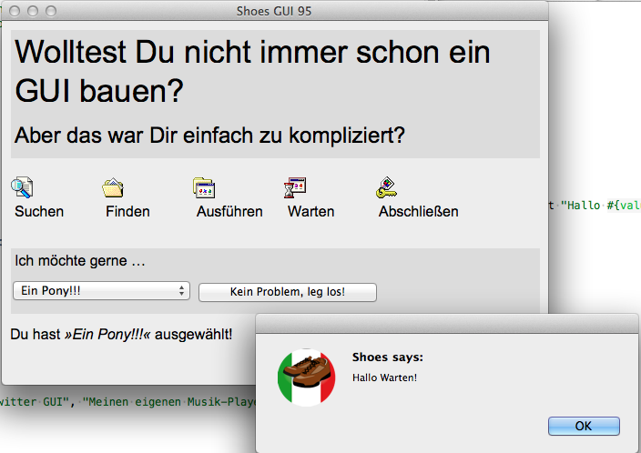

# Keiner kennt Shoes: GUI 95 (2)

Im [letzten Kapitel][1] habe ich gezeigt, wie einfach man mit [Shoes][2], dem kleinen, plattformübergreifenden GUI- und 2D-Graphik-Toolkit für [Ruby][3], ein User-Interface bauen kann. Nun möchte ich zeigen, wie man dieses GUI mit Leben füllt, das heißt, wie dieses GUI auf Nutzereingaben reagiert:

[1]: 06shoes.html
[2]: http://cognitiones.kantel-chaos-team.de/programmierung/creativecoding/shoes.html
[3]: http://cognitiones.kantel-chaos-team.de/programmierung/ruby/ruby.html

Am einfachsten ging das mit den kleinen Icons, die nach einem Klick einfach eine Alert-Box zeigen sollten, die sich mit dem Namen des Icons meldete. Bilder besitzen, wie viele andere Elemente auch, in Shoes den *Style* `:click`, dem eine Prozedur übergeben werden kann. Und so reicht es, wenn man diesen in der Schleife an jedes der Icons dranhängt:

~~~ruby
     buttons.each do |key, value|
       stack width: 100 do
         image "images/#{key.to_s}.gif"; click{alert "Hallo #{value}!"}
         para value
       end
     end
~~~

Dabei braucht man den `value` des jeweiligen *Hashes* nicht wie den `key` in einen String konvertieren, da er ja schon ein String ist.

Etwas schwieriger gestaltete sich das mit der Listbox. Hier wollte ich, daß in einem Paragraphen unterhalb der Box und des Knöpfchens nach einer Veränderung ausgegeben wird, welches Element in der Listbox der Nutzer ausgewählt hat.

Und wenn der Nutzer den Button drückt, soll einfach wieder nur eine Alertbox mit dem ausgewählten Text ausgegeben werden.

Deshalb habe ich mit

~~~ruby
@changes = stack margin: 5
~~~

erst einmal diesen neuen Paragraphen angelegt (`margin: 5` habe ich durch Experimentieren herausgefunden). Wichtig ist, daß man in Shoes jedes angelegtn Element einer Variablen zuweisen kann, wie hier in diesem Fall der Instanz-Variable `@changes`. In Shoes sind Instanz-Variablen so etwas wie globale Variablen. Denn Shoes.App ist ein eigenens Objekt und daher entsprechen Instanzvariablen dem `self`, wie man es auch aus anderen objektorientierten Programmiersprachen kennt. Es ist daher in der Regel sinnvoll, Widgets, auf die man in einer Shoes-Anwendung zugreifen möchte, einer Instanzvariablen zu übergeben.

Das habe ich dann auch in dem `flow` mit der Listbox gemacht:

~~~ruby
    flow do
      @l = list_box items: ["Eine eigene Twitter GUI", "Meinen eigenen Musik-Player", "Ein Pony!!!"]
      button "Kein Problem, leg los!" do
        alert @l.text
      end
~~~

Das hat erst einmal den Vorteil, daß ich nun mit `@l.text` auf den Inhalt des ausgewählten Items zugreifen und es in einer Alertbox anzeigen kann.

Direkt darunter habe ich nun angegeben, was passieren soll, wenn der Nutzer eine Auswahl in der Listbox trifft:

~~~ruby
   @l.change do
     @changes.clear do
       para "Du hast ", em("»#{@l.text}«"), " ausgewählt!"
     end
   end
~~~

Wenn der Nutzer in der Listbox etwas auswählt, wird das *Event* `change` ausgelöst. Diesen Callback habe ich dann genutzt, um den oben angelegten Absatz `@changes` erst einmal zu leeren (`@changes.clear`) um dann hineinzuschreiben, welches Element (wieder mit `@l.text`) der Listbox ausgewählt wurde.

Mehr Änderungen waren nicht notwendig um dieses GUI mit Leben zu füllen. Zm Nachschlagen und Nachprogrammieren hier der vollständige Quelltext, der immer noch von erfrischender Kürze ist:

~~~ruby
# encoding: utf-8

Shoes.app(title: "Shoes GUI 95", width: 600, height: 400) do
    
	   stack margin: 10 do
	     background gainsboro
	     subtitle "Wolltest Du nicht immer schon ein GUI bauen?"
	     tagline "Aber das war Dir einfach zu kompliziert?"
	   end
    
	   stack margin: 10 do
	     flow do
	       buttons = {
	         find: "Suchen",
	         documents: "Finden",
	         programs: "Ausführen",
	         run: "Warten",
	         logoff: "Abschließen"
	       }
    
	       buttons.each do |key, value|
	         stack width: 100 do
	           image "images/#{key.to_s}.gif"; click{alert "Hallo #{value}!"}
	           para value
	          end
	       end
	     end
	   end
  
	   stack margin: 10 do
	     background gainsboro
	     para "Ich möchte gerne …"
	     flow do
	       @l = list_box items: ["Eine eigene Twitter GUI", "Meinen eigenen Musik-Player", "Ein Pony!!!"]
	       button "Kein Problem, leg los!" do
	         alert @l.text
	       end
	       @l.change do
	         @changes.clear do
	           para "Du hast ", em("»#{@l.text}«"), " ausgewählt!"
	         end
	       end
	     end
	   end
	   @changes = stack margin: 5
end
~~~

Wer damit herumspielt, wird feststellen, daß es mindestens noch eine kleine Ungereimtheit in dem Progrämmchen gibt: Zwar reagieren alle Schaltflächen auf einen Klick, der Mauszeiger verändert sich aber nicht, wenn er über den Icons oder den Widgets schwebt, das heißt, der Nutzer bekommt kein Feedback, daß er hier klicken kann. Das ist bei dem Button und der Listbox sicher unproblematisch und nur unschön, aber woher soll der Nutzer wissen, daß er auf die Bildchen klicken kann?

Zwar kennt Shoes die Events `hoover` und `leave`, man kann auf die Position des Mauszeigers über einem *Slot* also durchaus reagieren, aber ich habe in der Dokumentation nirgendwo etwas gefunden, wie man das Aussehen des Mauszeigers verändern kann, also zum Beispiel vom Pfeil zum Finger und wieder retour. 

---

Zurück zur [Startseite](index.html).